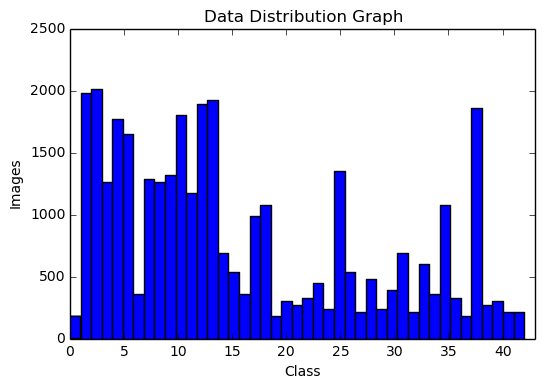
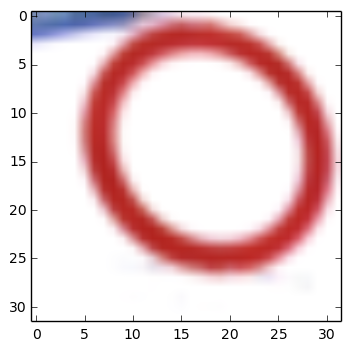
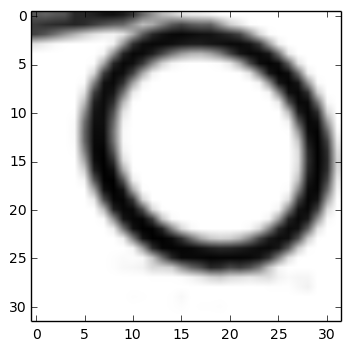
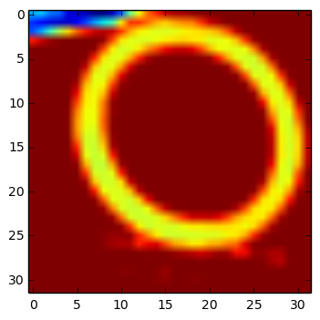
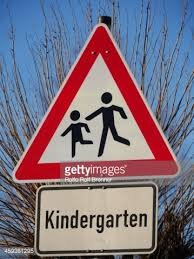
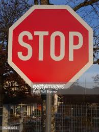
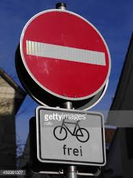
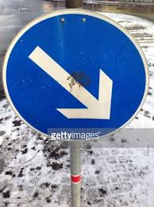

**Traffic Sign Recognition** 

**Build a Traffic Sign Recognition Project**

The goals / steps of this project are the following:
* Load the data set (see below for links to the project data set)
* Explore, summarize and visualize the data set
* Design, train and test a model architecture
* Use the model to make predictions on new images
* Analyze the softmax probabilities of the new images
* Summarize the results with a written report

[//]: # (Image References)

[image1]: ./examples/visualization.jpg "Visualization"
[image2]: ./examples/grayscale.jpg "Grayscaling"
[image3]: ./examples/random_noise.jpg "Random Noise"
[image4]: ./examples/placeholder.png "Traffic Sign 1"
[image5]: ./examples/placeholder.png "Traffic Sign 2"
[image6]: ./examples/placeholder.png "Traffic Sign 3"
[image7]: ./examples/placeholder.png "Traffic Sign 4"
[image8]: ./examples/placeholder.png "Traffic Sign 5"

## Rubric Points
Here I will consider the [rubric points](https://review.udacity.com/#!/rubrics/481/view) individually and describe how I addressed each point in my implementation.  

## Writeup / README
#### 1. Provide a Writeup / README that includes all the rubric points and how you addressed each one. You can submit your writeup as markdown or pdf. You can use this template as a guide for writing the report. The submission includes the project code.

Here is a link to my [project code](https://github.com/udacity/CarND-Traffic-Sign-Classifier-Project/blob/master/Traffic_Sign_Classifier.ipynb)

### Data Set Summary & Exploration

#### 1. Provide a basic summary of the data set and identify where in your code the summary was done. In the code, the analysis should be done using python, numpy and/or pandas methods rather than hardcoding results manually.

##### Code in cell 4
I used numpy to get the shape of the array. 
The first index is the size of the data and the rest denotes the shape of an image.
Numpy has 'unique' funcion which I used to get distinct labels.

* The size of training set is 34799
* The size of test set is 4410, 32, 32, 3 
* The shape of a traffic sign image is (32, 32, 3) 
* The number of unique classes/labels in the data set is 43

#### 2. Include an exploratory visualization of the dataset and identify where the code is in your code file.
 
##### Code in cell 9

Here is an exploratory visualization of the data set. It is a bar chart showing how the data is distributed among classes.  

### Design and Test a Model Architecture

#### 1. Describe how, and identify where in your code, you preprocessed the image data. What tecniques were chosen and why did you choose these techniques? Consider including images showing the output of each preprocessing technique. Pre-processing refers to techniques such as converting to grayscale, normalization, etc.

##### Code in cell 10

I read that grayscale images perform well in classification in LeNet5 paper. So I Converted images to grayscale. [Reference](http://stackoverflow.com/questions/12201577/how-can-i-convert-an-rgb-image-into-grayscale-in-python)

I knew that mean normalization will improve the contrast and it can help the network to generalize better. So I applied mean normalization. But I later noticed that the network could not learn much with mean normalized data. So I proceeded with gray images for training.  

* Actual Image

* Grayscale Image
 
* Mean normalized Image

#### 2. Describe how, and identify where in your code, you set up training, validation and testing data. How much data was in each set? Explain what techniques were used to split the data into these sets. (OPTIONAL: As described in the "Stand Out Suggestions" part of the rubric, if you generated additional data for training, describe why you decided to generate additional data, how you generated the data, identify where in your code, and provide example images of the additional data)

I was already given the split data. I did not have to separate it again. The only thing I did is to shuffle the train data. I did not augment the data. I just proceeded to use the current data for experiments.

#### 3. Describe, and identify where in your code, what your final model architecture looks like including model type, layers, layer sizes, connectivity, etc.) Consider including a diagram and/or table describing the final model.

##### Code in cell 16

My final model consisted of the following layers:

| Layer         		|     Description	        					| 
|:---------------------:|:---------------------------------------------:| 
| Input         		| 32x32x1 Gray image   							| 
| Convolution 3x3     	| 1x1 stride, same padding, Kernel 3, outputs 16|
| RELU					|												|
| Max pooling	        | 2x2 stride,  outputs 16 				        |
| Convolution 3x3     	| 1x1 stride, same padding, Kernel 3, outputs 32|
| RELU					|												|
| Max pooling	      	| 2x2 stride,  outputs 32 				        |
| Convolution 3x3	    | 1x1 stride, same padding, Kernel 3, outputs 64|
| Fully connected		| outputs 512       							|
| Fully connected		| outputs 128       							|
| Softmax				| outputs 43        							|

#### 4. Describe how, and identify where in your code, you trained your model. The discussion can include the type of optimizer, the batch size, number of epochs and any hyperparameters such as learning rate.

##### Code in cell 16

#### Nework parameters:
* Optimizer - I use Adam optimizer because it is shown to work well by computing adaptive learning rates for each parameter. [Reference](http://sebastianruder.com/optimizing-gradient-descent/index.html#adam)
* Batch size - I usually give batch sizes keeping the GPU memory usage in my mind. As our images are small, I go for 128.
* Epochs - Number of epochs cannot be set to certain fixed number. I set considerably big number so that I can stop when the loss is not going down anymore. 
* Learning rate - I started with 0.001 and seems to be working well. Ideally we can start with some value and if we notice high loss fluctuations or slow learning, it can then be adjusted.
* Dropout - I set 0.5 dropout to both fully connected layers to avoid overfitting. I observed that without dropout, I get 7 to 8 percent less accuracies on test set.

#### 5. Describe the approach taken for finding a solution. Include in the discussion the results on the training, validation and test sets and where in the code these were calculated. Your approach may have been an iterative process, in which case, outline the steps you took to get to the final solution and why you chose those steps. Perhaps your solution involved an already well known implementation or architecture. In this case, discuss why you think the architecture is suitable for the current problem.

##### Code in cell 18

My final model results were:
* training set accuracy of 97.65
* validation set accuracy of 96.28 
* test set accuracy of ? 93.8

If an iterative approach was chosen:
* What was the first architecture that was tried and why was it chosen?

I started with Lenet 5 architecture because it is small, yet powerful enough to recognize digits and letters.

* What were some problems with the initial architecture?

Accuracy of test data is around 80%. Although train accuracies are above 95%. I know that it is an overfitting problem.

* How was the architecture adjusted and why was it adjusted? Typical adjustments could include choosing a different model architecture, adding or taking away layers (pooling, dropout, convolution, etc), using an activation function or changing the activation function. One common justification for adjusting an architecture would be due to over fitting or under fitting. A high accuracy on the training set but low accuracy on the validation set indicates over fitting; a low accuracy on both sets indicates under fitting.

I wanted to see if it improves a bit if I add one more convolution layer. So I did add an extra layer and observed that there is approximately 5% improvement. 

* Which parameters were tuned? How were they adjusted and why?

As I understood that it is an overfitting problem, I introduced 0.5 dropout to both fully connected layers. Then I get approximately 94% accuracy on test set.

* What are some of the important design choices and why were they chosen? For example, why might a convolution layer work well with this problem? How might a dropout layer help with creating a successful model?

I answered most of it above. The convolution layer captures spatial features unlike fully connected layer which is a consolidated feature map. So I added a convolution layer which might further capture spatial patterns at high level.

If a well known architecture was chosen:
* What architecture was chosen?

LeNet5

* Why did you believe it would be relevant to the traffic sign application?

LeNet5 also works on classification problem with input image size similar to our data.
* How does the final model's accuracy on the training, validation and test set provide evidence that the model is working well?

I modified LeNt a bit to achieve 94% test accuracy (also similar accuracies on train and validation set).
 

### Test a Model on New Images

#### 1. Choose five German traffic signs found on the web and provide them in the report. For each image, discuss what quality or qualities might be difficult to classify.

Here are five German traffic signs that I found on the web:

    

I found the images from google. All images are clear and captured at different angles. So I thought network could easily classify them. But the network failed to classify on all images except the last one.

#### 2. Discuss the model's predictions on these new traffic signs and compare the results to predicting on the test set. Identify where in your code predictions were made. At a minimum, discuss what the predictions were, the accuracy on these new predictions, and compare the accuracy to the accuracy on the test set (OPTIONAL: Discuss the results in more detail as described in the "Stand Out Suggestions" part of the rubric).

##### Code in cell 25 and 26

Here are the results of the prediction:

| Image			        |     Prediction	        					| 
|:---------------------:|:---------------------------------------------:| 
| Children crossing 	| Traffic signals 									| 
| Stop    			| Priority road										|
| Speed limit (60km/h)					| No passing											|
| No entry      		|  Priority road					 				|
| Keep right		| Keep right      							|

I got 20% accuracy on these images.

#### 3. Describe how certain the model is when predicting on each of the five new images by looking at the softmax probabilities for each prediction and identify where in your code softmax probabilities were outputted. Provide the top 5 softmax probabilities for each image along with the sign type of each probability. (OPTIONAL: as described in the "Stand Out Suggestions" part of the rubric, visualizations can also be provided such as bar charts)

##### visualization code in cells 29 to 33

For the first four images, the network predictions are nowhere near the groundtruth. For the last image, it predicted at 100% probability.

| Probability         	|     Prediction	        					| 
|:---------------------:|:---------------------------------------------:| 
| 1.0         			| Keep right   									| 

